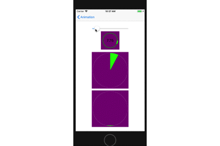

### BasicAnimation

1、keyPath

       rotation 旋轉
    
       scale 缩放
     
       translation 平移
       
       CGPoint Key Paths : (example)position.x 位移
    
       CGRect Key Paths : (example)bounds.size.width 伸缩
    
       origin 原点
       
       size 大小
       
       opacity 透明度
       
       backgroundColor  背景 颜色
     
       contents  内容
       
       Shadow Key Path: 阴影
       
2、

     duration：动画的持续时间
     
     
3、
　　<pre>repeatCount：动画的重复次数</pre>

4、
　　<pre>timingFunction：动画的时间节奏控制</pre>
       
  
### SpringAnimation

1、

    mass:
 
    质量，影响图层运动时的弹簧惯性，质量越大，弹簧拉伸和压缩的幅度越大
 
    动画的速度变慢，并且波动幅度变大
2、 

    stiffness:
 
    刚度系数(劲度系数/弹性系数)，刚度系数越大，形变产生的力就越大，运动越快
3、
 
    damping:
 
    阻尼系数，阻止弹簧伸缩的系数，阻尼系数越大，停止越快
4、

    initialVelocity:
 
    初始速率，动画视图的初始速度大小

    速率为正数时，速度方向与运动方向一致，速率为负数时，速度方向与运动方向相反
5、

     +(void)animateWithDuration:(NSTimeInterval)duration 
     delay:(NSTimeInterval)delay 
     usingSpringWithDamping:(CGFloat)dampingRatio   
     initialSpringVelocity:(CGFloat)velocity 
     options:(UIViewAnimationOptions)options 
     animations:(void (^)(void))animations 
     completion:(void (^ __nullable)(BOOL finished))completion NS_AVAILABLE_IOS(7_0);
     
          duration: 动画时长
          delay: 动画延迟
          damping: 弹簧效果
          springVelocity: 初始速度
          options: 过度效果
          
          
### keyFrameAnimation

draw  a curve

    keyFrame：
    path：路径
    duration：单次时间
    rotationMode：旋转样式
    repeatCount：重复次数
   
1、弧形
 
    - (void)addArcWithCenter:(CGPoint)center radius:(CGFloat)radius startAngle:(CGFloat)startAngle endAngle:(CGFloat)endAngle clockwise:(BOOL)clockwise ;
    center ： 弧形的中心
    radius： 弧形的半径
    startAngle：弧形开始弧度
    endAngle：弧形结束弧度
    colockwise：顺逆时针
 
2、抛物线

    - (void)moveToPoint:(CGPoint)point
    - (void)addQuadCurveToPoint:(CGPoint)endPoint controlPoint:(CGPoint)controlPoint;
    point：开始位置
    endPoint：结束位置
    controlPoint：拐点位置
 
3、椭圆形
 
    + (instancetype)bezierPathWithOvalInRect:(CGRect)rect;
    rect： x起点
           y起点
           width宽度
           height高度
          
4、圆形

    rect：
    width = height
 
   
### TransitionAnimation

* duration

<pre>设置动画时间</pre>

* type

<pre>设置运动类型

1、公有API的Type

    Fade,                       淡入淡出
    Push,                       推挤
    Reveal,                     揭开
    MoveIn,                     覆盖
    
2、私有API的Type

    Cube,                       立方体
    SuckEffect,                 吮吸
    OglFlip,                    翻转
    RippleEffect,               波纹
    PageCurl,                   翻页
    PageUnCurl,                 反翻页
    CameraIrisHollowOpen,       开镜头
    CameraIrisHollowClose,      关镜头
    
3、UIView翻页Type

    CurlDown,                   下翻页
    CurlUp,                     上翻页
    FlipFromLeft,               左翻转
    FlipFromRight,              右翻转
</pre>
    
* subtype

<pre>设置运动方向

    kCATransitionFromLeft
    kCATransitionFromBottom
    kCATransitionFromRight
    kCATransitionFromTop
    
</pre>

* timingFunction

<pre>设置运动轨迹

 kCAMediaTimingFunctionLinear            线性,即匀速
 kCAMediaTimingFunctionEaseIn            先慢后快
 kCAMediaTimingFunctionEaseOut           先快后慢
 kCAMediaTimingFunctionEaseInEaseOut     先慢后快再慢
 kCAMediaTimingFunctionDefault           实际效果是动画中间比较快.
 
</pre>
    
    
4、使用方法

    - (void) transitionWithType:(NSString *)type WithSubtype:(NSString *)subtype ForView:(UIView *)view{
    CATransition *animation = [CATransition animation];
    animation.duration = 0.7f;
    animation.type = type;
    if (subtype != nil) {
        animation.subtype = subtype;
    }
    [view.layer addAnimation:animation forKey:@"animation"];
     }
     
5、实例应用，UIView上下左右翻页

    - (void) animationWithView : (UIView *)view WithAnimationTransition : (UIViewAnimationTransition) transition{
    [UIView animateWithDuration:1.0f animations:^{
        [UIView setAnimationCurve:UIViewAnimationCurveEaseInOut];
        [UIView setAnimationTransition:transition forView:view cache:YES];
    } completion:^(BOOL finished) {
        self.title = @"0000";
    }];
    }
    
    
### ProgressAnimation

#### UIBezierPath方法详解
UIBezierPath 顾名思义，这是用贝塞尔曲线的方式来构建一段弧线，你可以用任意条弧线来组成你想要的形状

    -(void)addArcWithCenter:(CGPoint)center radius:(CGFloat)radius startAngle:(CGFloat)startAngle endAngle:(CGFloat)endAngle clockwise:(BOOL)clockwise
    center 圆弧圆心
    radius 圆弧半径
    startAngle 开始弧度
    endAngle 结束弧度
    closewise 是否顺时针
    
    -(void)fill
    填充颜色
    -(void)stroke
    线条颜色
    
注: 使用UIBezierPath绘画的代码写在自定义视图的drawRect:方法中
    
#### CAShaperLayer 

CAShaperLayer也就是在现有的图层上再次添加或覆盖一层以达到界面在显示时会呈现出不同形状的效果   

     fillColor 填充颜色
     strokeColor 边框颜色
     lineWidth 线条宽度
     path 线条曲线
     strokeStart 开始角度
     strokeEnd 结束角度

注：进度条主要就以上方法

#### 圆形进度条生成
1. UIBezierPath根据进度条随时改变开始弧度和结束弧度，不设置中心point

<pre>
- (void)drawRect:(CGRect)rect {
    CGPoint point = CGPointMake(100, 100);
    CGFloat radius = 95.0f;
    
    UIBezierPath *ballPath = [UIBezierPath bezierPathWithArcCenter:point radius:radius startAngle:self.startAngle endAngle:self.endAngle clockwise:YES];
    
    [[UIColor greenColor]set];
    [ballPath fill];
    
    //    在球形的外面绘制一个描边空心的圆形，不然很难看
    UIBezierPath *strokePath = [UIBezierPath bezierPathWithArcCenter:point radius:radius startAngle:0 endAngle:-0.00000001 clockwise:YES];
    [[UIColor lightGrayColor]set];
    [strokePath stroke];
}

-(void)setStartMove:(CGFloat)value{
    
    //    设置起始点，位置是根据进度动态变换的
    self.startAngle = M_PI_2 - value * M_PI;
    self.endAngle = M_PI_2 + value * M_PI;
    
    [self setNeedsDisplay];
}
</pre>

#### 扇形进度条生成
1. UIBezierPath根据进度条随时改变结束弧度，设置中心point

<pre>
-(void)drawRect:(CGRect)rect{
    CGPoint point = CGPointMake(100 , 100);
    CGFloat radius = 95.0f;
    CGFloat startAngle = - M_PI_2;
    CGFloat endAngle = startAngle + self.endAngle;
    UIBezierPath * path = [UIBezierPath bezierPathWithArcCenter:point radius:radius startAngle:startAngle endAngle:endAngle clockwise:YES];
    [path addLineToPoint:point];
    [[UIColor greenColor]set];
    [path fill];
    UIBezierPath *strokePath = [UIBezierPath bezierPathWithArcCenter:point radius:radius startAngle:0 endAngle:-0.00000001 clockwise:YES];
    [[UIColor lightGrayColor]set];
    [strokePath stroke];
    
}
- (void)setStartMove:(CGFloat)value{
    self.endAngle = value * M_PI * 2;
    [self setNeedsDisplay];
}
</pre>

#### 弧形进度条生成

1. 先画一个封闭的背景圆self.backShaperLayer
2. 根据圆弧先设置self.shaperLayer的开始，根据进度条的改变随时改变结束弧度

<pre>
- (void)drawRect:(CGRect)rect{

    self.shapeLayer = [CAShapeLayer layer];
    self.shapeLayer.fillColor = [UIColor clearColor].CGColor;
    self.shapeLayer.lineWidth = 6.0f;
    self.shapeLayer.strokeColor = [UIColor greenColor].CGColor;
    
  
    self.backShapeLayer = [CAShapeLayer layer];
    self.backShapeLayer.fillColor = [UIColor clearColor].CGColor;
    self.backShapeLayer.lineWidth = 6.0f;
    self.backShapeLayer.strokeColor = [UIColor darkGrayColor].CGColor;

    UIBezierPath * path = [UIBezierPath bezierPath];
    [path addArcWithCenter:CGPointMake(50, 50) radius:40 startAngle:0 endAngle:M_PI * 2 clockwise:YES];
    
    self.shapeLayer.path = path.CGPath;
    self.shapeLayer.strokeStart = 0;
    self.shapeLayer.strokeEnd = self.toValue;
    self.backShapeLayer.path = path.CGPath;
    self.backShapeLayer.strokeStart = 0;
    self.backShapeLayer.strokeEnd = 1;
    [self.layer addSublayer:self.backShapeLayer];
    [self.layer addSublayer:self.shapeLayer];

}
- (void)setStartMove:(CGFloat)value{
    self.toValue = value;
    [self setNeedsDisplay];
}
</pre>

